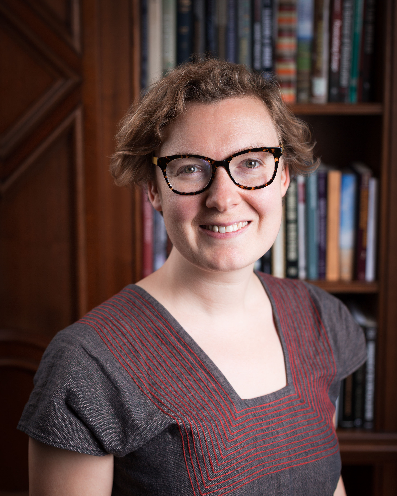

I am a Lecturer in Digital Humanities in the Department of History at Lancaster University and also a Senior Research Fellow at The Alan Turing Institute in London, UK. 

My first book manuscript *Public Work: Making Roads and Citizens in Eighteenth-Century France* examines unsuccessful socio-economic and political reforms related to infrastructure development in pre-Revolutionary France. 

My digital work uses computational image, text, and spatial analysis to create new ways of doing historical research with large library and archival collections as data. I lead the [MapReader](https://github.com/maps-as-data/MapReader) project, a software library for analyzing the visual and textual content of historical maps. 

I completed my PhD in History at Stanford University. Please see [my profile at Lancaster](https://www.lancaster.ac.uk/history/about/people/katherine-mcdonough) for more details.

## Contact

k.mcdonough at lancaster.ac.uk

## Projects

[Data/Culture: Building sustainable communities around Arts and Humanities datasets and tools](https://www.turing.ac.uk/research/research-projects/dataculture-building-sustainable-communities-around-arts-and-humanities)

*Public Work: Making Roads and Citizens in Eighteenth-Century France*

[Machines Reading Maps](https://www.turing.ac.uk/research/research-projects/machines-reading-maps)

[Living with Machines](https://www.turing.ac.uk/research/research-projects/living-machines)

[GEODE](https://geode-project.github.io/)

[Early Modern Mobility](https://emmobility.github.io/emm_site/)

[Mapping Print, Charting Enlightenment](http://fbtee.uws.edu.au/mpce/the-project/)

## Selected Publications

K. McDonough, “Maps as Data,” in [*Debates in DH: Computational Humanities*](https://dhdebates.gc.cuny.edu/projects/computational-humanities-preprint), ed. by J. M. Johnson, D. Mimno, & L. Tilton (University of Minnesota Press, 2024). 

G. Tolfo, O. Vane, K. Beelen, K. Hosseini, J. Lawrence, D. Beavan, & K. McDonough, “Hunting for Treasure: Living with. Machines and the British Library Newspaper Collection,” in [*Digitised Newspapers: A New Eldorado for Historians?*](https://library.oapen.org/handle/20.500.12657/61093) ed. by E. Bunout, M. Ehrmann, & F. Clavert (De Gruyter Oldenbourg, 2022).

K. Hosseini, K. Beelen, D. Wilson, & K. McDonough, “[MapReader: A Computer Vision Pipeline for the Semantic Exploration of Maps at Scale](https://dl.acm.org/doi/10.1145/3557919.3565812),” *Proceedings for the ACM SIGSPATIAL Geohumanities Workshop* (2022).

A. Brenon, L. Moncla, & K. McDonough, “[Classifying Encyclopedic Knowledge: Comparing Machine and Deep Learning Methods and Exploring Their Predictions](https://www.sciencedirect.com/science/article/abs/pii/S0169023X22000891),” *Data & Knowledge Engineering* 142 (2022).

D. Vigier, K. McDonough, T. Joliveau, L. Moncla, & I. Lefort, « [Les articles de géographie dans le Dictionnaire Universel de Trévoux et l’Encyclopédie de Diderot et d’Alembert](https://www.revues.armand-colin.com/lettres-langues/langue-francaise/langue-francaise-no214-22022/articles-geographie-dictionnaire-universel-trevoux-lencyclopedie-diderot-dalembert) », *Langue française* (2022).

M. Coll Ardanuy, K. Beelen, J. Lawrence, K. McDonough, et al, “[Station to Station: Linking and enriching historical British railway data](https://ceur-ws.org/Vol-2989/long_paper29.pdf),” *Computational Humanities Research 2021* (2021).

K. Hosseini, K. McDonough, D. van Strien, O. Vane, & D. Wilson, “[Maps of a Nation? Working with Digitised Ordnance Survey Maps as Sources for Historical Research](https://academic.oup.com/jvc/article/26/2/284/6232245),” *Journal of Victorian Culture* 26, no. 2 (April 2021), 284-299. 

“Putting the Eighteenth Century on the Map: A Proposal for Early Modern French Geospatial Data Development,” in [*Digitizing Enlightenment*](https://liverpooluniversitypress.manifoldapp.org/projects/digitizing-enlightenment), ed. by G. Roe & S. Burrows (Oxford Studies in the Enlightenment/Liverpool University Press, 2020), 277-303. 

M. Coll Ardanuy, F. Nanni, K. Beelen, K. Hosseini, R. Ahnert, J. Lawrence, K. McDonough, G. Tolfo, DCS Wilson, & B. McGillivray, “[Living Machines: A study of atypical animacy](https://aclanthology.org/2020.coling-main.400/),” *COLING2020*, The 28th International Conference on Computational Linguistics (2020).

K. McDonough, L. Moncla, & M. van de Camp, “[Named Entity Recognition Goes to Old Regime France: Geographic Text Analysis for Early Modern French Corpora](https://www.tandfonline.com/doi/full/10.1080/13658816.2019.1620235),” *International Journal of Geographical Information Science* 33, no. 12 (May 2019), 2498-2522. 

“Un domaine provincial? Les États de Bretagne, le domaine royal et la construction des routes au XVIIIe siècle,” in *Le financement des infrastructures de transport*, ed. by A. Conchon, D. Plouviez, & E. Szulman (Paris: Comité pour l’histoire économique et financière de la France, 2018), 55-80. 

## Teaching

At Lancaster I teach early modern and modern French history at the undergraduate level and digital humanities at the postgraduate level. Recent courses include "Spatial Technologies for Humanities Research" and "Digital Texts in the Humanities".

I also regularly teach workshops on using computational methods in historical research, especially for maps, newspapers, and encyclopedias.

Previously, I have taught survey courses on early modern European history, world history, and the history of science and technology. I have also taught advanced undergraduate seminars on the French Enlightenment and Revolution, nature and empire in the early modern world, French peasants, and the history of maps and mapping. 

